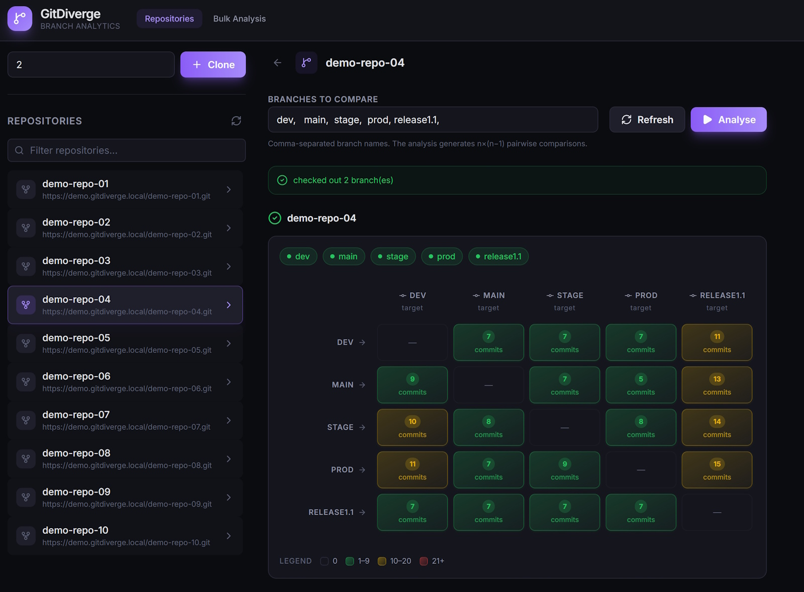

# GitDiverge

[](https://github.com/dmandreev/gitdivergesvc/actions/workflows/ci.yml)
[](https://www.rust-lang.org)
[](https://git-scm.com)
[](LICENSE)

GitDiverge is a **blazing fast git repository branch divergence analysis service**. It clones repositories, checks out branches, and computes **pairwise commit divergence** across branch sets — showing exactly which commits exist in one branch but are missing from another. Results are available through a command-line interface, a REST API with real-time progress streams, and an embedded React web UI.

For `n` branches, the service produces `n × (n-1)` ordered comparisons based on commit-hash equality, making it easy to spot drift between release lines, feature branches, or long-lived integration branches.



---

## Table of Contents

- [Features](#features)
- [Quick Start](#quick-start)
- [Building from Source](#building-from-source)
- [Usage](#usage)
  - [CLI — Single Repository](#cli--single-repository)
  - [CLI — Batch Mode](#cli--batch-mode)
  - [Daemon — Web Service](#daemon--web-service)
- [Configuration](#configuration)
- [API Overview](#api-overview)
- [Web Client](#web-client)
- [Development](#development)
- [Authentication](#authentication)
- [Releases](#releases)
- [License](#license)

---

## Features

- **Pairwise divergence analysis** — Compare every branch against every other branch and see missing commits.
- **Pluggable git backends** — Use the system `git` executable (`ProcessGitProvider`) or a pure-Rust implementation (`GixProvider`).
- **Real-time progress streaming** — Long-running operations stream progress via Server-Sent Events (SSE).
- **In-memory result cache** — Computed analytics are cached with a 2 GB memory bound; stale entries are invalidated automatically on fetch/clone.
- **Batch pipeline** — Run clone → fetch → analytics across a fleet of repositories in one command or API call.
- **Embedded web UI** — A React SPA is compiled into the binary and served at runtime; no separate web server needed.
- **OpenAPI & Swagger UI** — Fully documented REST API with auto-generated OpenAPI spec and interactive explorer.
- **Cross-platform** — Runs on Windows and Linux.

---

## Quick Start

```bash
# Clone and build
git clone https://github.com/dmandreev/gitdivergesvc.git
cd gitdivergesvc
cargo build --release

# Run CLI analysis on a public repository
cargo run -- run https://github.com/torvalds/linux.git --branches main,v6.13

# Start the web daemon (auth disabled for local dev)
cargo run -- daemon --bind 127.0.0.1 --port 8080 -vv
```

Open http://127.0.0.1:8080 to use the web UI, or visit http://127.0.0.1:8080/swagger-ui to explore the API.

---

## Building from Source

### Prerequisites

- **Rust** 1.95 or later
- **Git** 2.30.2 or later available in `PATH`
- **Node.js** 22+ (only if building the web client)

### Steps

```bash
# Build the Rust workspace (library + binary)
cargo build --release

# Build with the embedded web client
cd webclientsrc
npm ci
npm run build
cd ..
cargo build --release

# Or build the fully optimised binary
cargo build --profile extreme
```

The optimised profile (`extreme`) enables LTO, single codegen unit, and strip for the smallest binary size.

### Docker

```bash
docker build -t gitdiverge .
docker run -p 8080:8080 gitdiverge
```

---

## Usage

### CLI — Single Repository

Analyze a single repository and print divergence results as JSON:

```bash
gitdiverge run <REPO_URL> \
  --branches main,release/1.0,feature/x \
  -o divergence.json
```

Options:
- `--branches` — Comma-separated list of branches to compare.
- `--branches-file` — Path to a file containing one branch per line.
- `-o, --output` — Write JSON results to a file instead of stdout.

### CLI — Batch Mode

Process many repositories at once using text file inputs:

```bash
gitdiverge run \
  --repositories-file repositories.txt \
  --branches-file branches.txt \
  -o batch-results.json
```

`repositories.txt` contains one repository URL per line. `branches.txt` contains one branch name per line. The tool runs a three-phase pipeline (clone → fetch/checkout → analytics) for every repository and aggregates the results.

### Daemon — Web Service

Start the HTTP server:

```bash
# Development (verbose logging, no auth)
gitdiverge daemon --bind 127.0.0.1 --port 8080 -vv

# Production (auth enabled, config file)
gitdiverge daemon --auth --config gitdiverge.toml
```

The daemon serves:
- The React web client at `/`
- The REST API under `/api/v1/`
- Swagger UI at `/swagger-ui`
- A health endpoint at `/health`

---

## Configuration

The daemon accepts an optional TOML configuration file:

```bash
gitdiverge daemon --config gitdiverge.toml
```

Key sections:

| Section | Purpose |
|---------|---------|
| `[auth]` | Enable/disable JWT validation and select mode (`local` or `jwks`). |
| `[[git_credentials]]` | Per-host tokens for private repositories (injected via `GIT_ASKPASS`). |
| `[webclient]` | Runtime settings for the SPA: `api_base`, `oidc_authority`, `oidc_client_id`, `jira_server_addr`. |

See [`gitdiverge.toml.example`](gitdiverge.toml.example) for a full annotated configuration.

---

## API Overview

All mutating endpoints stream progress via **Server-Sent Events** (`event: progress`) and finish with either `event: complete` or `event: error`.

| Method | Path | Description |
|--------|------|-------------|
| `GET` | `/health` | Health check and version info. |
| `GET` | `/api/v1/repos` | List indexed repositories. |
| `GET` | `/api/v1/repos/{guid}/branches` | List remote-tracking branches. |
| `POST` | `/api/v1/repos/clone` | Clone a repository (SSE). |
| `POST` | `/api/v1/repos/{guid}/fetch` | Fetch and checkout branches (SSE). |
| `GET` | `/api/v1/repos/{guid}/divergence` | Branch divergence analysis (SSE). |
| `GET` | `/api/v1/repos/{guid}/divergence/commits` | Paginated missing commits for a branch pair. |
| `POST` | `/api/v1/batch/divergence` | Batch three-phase pipeline across repos (SSE). |
| `GET` | `/swagger-ui` | Interactive OpenAPI explorer. |
| `GET` | `/api-docs/openapi.json` | Raw OpenAPI specification. |

Protected endpoints require a Bearer token when `--auth` is enabled. See [AUTHENTICATION.md](AUTHENTICATION.md) for details.

---

## Web Client

The frontend is a **React 19 + TypeScript + Vite** application embedded into the Rust binary at compile time.

- **Development**: `cd webclientsrc && npm run dev` (expects the daemon running separately).
- **Production**: `cd webclientsrc && npm run build`, then build the Rust binary. The `dist/` folder is automatically embedded via `include_dir!`.

Key UI features:
- **N×N divergence matrix** — Visual grid showing commit counts between every branch pair.
- **Virtualised commit lists** — Smooth scrolling through thousands of commits.
- **Slide-over detail panels** — Inspect full commit metadata (hash, author, timestamp, message).
- **JIRA integration** — Optional links to tickets when `jira_server_addr` is configured.
- **Bulk progress panel** — Track batch operations across multiple repositories in real time.

---

## Development

```bash
# Run all tests
cargo test --workspace

# Run linting
cargo clippy --workspace -- -D warnings

# Format code
cargo fmt --all

# Generate OpenAPI spec
cargo run -- openapi -o openapi.json

# Generate demo repositories
cargo run -- demo -c 10 -o demo-repos/
```

The workspace contains two crates:
- **`gitdiverge-lib/`** — Core library: git abstractions, analytics, batching, and concurrency primitives.
- **`gitdiverge/`** — Binary crate: CLI, HTTP daemon, authentication, caching, and demo data.

---

## Authentication

GitDiverge supports optional stateless JWT authentication for the REST API and web client. When enabled, all mutating and data endpoints require a valid `Authorization: Bearer <token>` header.

Authentication is **disabled by default** and can be enabled with the `--auth` CLI flag or the `[auth]` section in the configuration file. The daemon validates tokens locally using cached JWKS or an embedded test key — no external Identity Provider calls occur during request handling.

For full details on configuration, validation modes, claims, and test-token generation, see **[AUTHENTICATION.md](AUTHENTICATION.md)**.

---

## Releases

Pre-built binaries for Linux (x86_64) and Windows (x86_64) are available on the [Releases](https://github.com/dmandreev/gitdivergesvc/releases) page. Every release is produced automatically from the `extreme` Cargo profile (LTO, single codegen unit, stripped) and includes the embedded web client.

### Creating a new release

Releases are fully automated via GitHub Actions. To publish a new version:

1. Update the version in the workspace `Cargo.toml` if needed.
2. Update `CHANGELOG.md` with the new version entry.
3. Commit and push the changes.
4. Create and push an annotated tag following [Semantic Versioning](https://semver.org/):

   ```bash
   git tag -a v0.1.0 -m "Release v0.1.0"
   git push origin v0.1.0
   ```

5. The [Release workflow](.github/workflows/release.yml) will:
   - Build the web client.
   - Compile the `gitdiverge` binary with `--profile extreme` on Ubuntu and Windows runners.
   - Package the binaries with `LICENSE`, `README.md`, and `gitdiverge.toml.example`.
   - Generate SHA-256 checksums.
   - Create a GitHub release with auto-generated release notes and attach all assets.

No manual upload or local cross-compilation is required.

## License

This project is licensed under the [MIT License](LICENSE).
